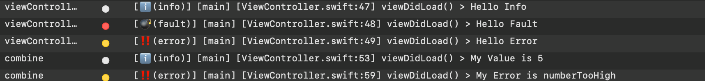

# LoggingKit

<p align="center">
   
</p>

<p align="center">
   <a href="https://developer.apple.com/swift/">
      
   </a>
   <a href="https://github.com/apple/swift-package-manager">
      
   </a>
</p>

<p align="center">
LoggingKit is a micro framework for logging based on log providers 
</p>

## Features

- [x] Define your own log providers
- [x] `Combine` ready
- [x] Comes with pre-defined `OSLogProvider` which uses `os_log` under the hood

## Example

The example application is the best way to see `LoggingKit` in action. Open `Example/LoggingDemo` in Xcode and run the app.

After the application has started you should see several log messages in your Xcode console and the `Console.app` for the device you ran the app on.

## Installation

### Swift Package Manager

To integrate using Apple's [Swift Package Manager](https://swift.org/package-manager/), add the following as a dependency to your `Package.swift`:

```swift
dependencies: [
    .package(url: "https://github.com/alexanderwe/LoggingKit.git", from: "3.0.0")
]
```

Alternatively navigate to your Xcode project, select `Package Dependencies` and click the `+` icon to search for `LoggingKit`.

## Usage

### Define log categories

Extend `LogCategories` to declare the categories for your app:

```swift
import LoggingKit

extension LogCategories {
    var viewControllers: LogCategory { .init("viewControllers") }
    var networking: LogCategory { .init("networking") }
}
```

### Register log providers

Register one or more log providers at app startup:

```swift
import LoggingKit

@main
struct MyApp: App {
    init() {
        LogService.register(logProviders: OSLogProvider())
    }

    var body: some Scene {
        WindowGroup {
            ContentView()
        }
    }
}
```

### Log messages

```swift
import LoggingKit

LogService.debug("Hello Debug", logCategory: \.viewControllers)
LogService.verbose("Hello Verbose", logCategory: \.viewControllers)
LogService.info("Hello Info", logCategory: \.viewControllers)
LogService.warning("Hello Warning", logCategory: \.viewControllers)
LogService.error("Hello Error", logCategory: \.viewControllers)
```

### Combine

LoggingKit offers extensions on `Publisher` to log output and failure values inline:

```swift
import LoggingKit

// logs Self.Output
myPublisher.logValue(logType: .info, logCategory: \.networking) {
    "My Value is \($0)"
}

// logs Self.Failure
myPublisher.logError(logCategory: \.networking) {
    "My Error is \($0)"
}

// logs both Self.Output and Self.Failure
myPublisher.log()
```

### Custom providers

Conform to `LogProvider` to route logs to any backend:

```swift
import LoggingKit

struct MyCustomProvider: LogProvider {
    func log(
        _ event: LogType,
        _ message: @autoclosure () -> Any?,
        logCategory: KeyPath<LogCategories, LogCategory>,
        fileName: StaticString,
        functionName: StaticString,
        lineNumber: Int
    ) {
        guard let value = message() else { return }
        // Forward to your backend
        print("[\(event)] \(value)")
    }
}
```

Register it alongside the built-in provider:

```swift
LogService.register(logProviders: OSLogProvider(), MyCustomProvider())
```

### OSLogProvider

LoggingKit ships with `OSLogProvider`, which uses `os_log` under the hood. Messages appear in the `Console.app` on your Mac and in the Xcode console.

Open `Console.App`, select the target device, and filter by subsystem or category to view the messages printed by `OSLogProvider`.



## Contributing

Contributions are very welcome 🙌

## License

```
LoggingKit
Copyright (c) 2020 Alexander Weiß

Permission is hereby granted, free of charge, to any person obtaining a copy
of this software and associated documentation files (the "Software"), to deal
in the Software without restriction, including without limitation the rights
to use, copy, modify, merge, publish, distribute, sublicense, and/or sell
copies of the Software, and to permit persons to whom the Software is
furnished to do so, subject to the following conditions:

The above copyright notice and this permission notice shall be included in
all copies or substantial portions of the Software.

THE SOFTWARE IS PROVIDED "AS IS", WITHOUT WARRANTY OF ANY KIND, EXPRESS OR
IMPLIED, INCLUDING BUT NOT LIMITED TO THE WARRANTIES OF MERCHANTABILITY,
FITNESS FOR A PARTICULAR PURPOSE AND NONINFRINGEMENT. IN NO EVENT SHALL THE
AUTHORS OR COPYRIGHT HOLDERS BE LIABLE FOR ANY CLAIM, DAMAGES OR OTHER
LIABILITY, WHETHER IN AN ACTION OF CONTRACT, TORT OR OTHERWISE, ARISING FROM,
OUT OF OR IN CONNECTION WITH THE SOFTWARE OR THE USE OR OTHER DEALINGS IN
THE SOFTWARE.
```
